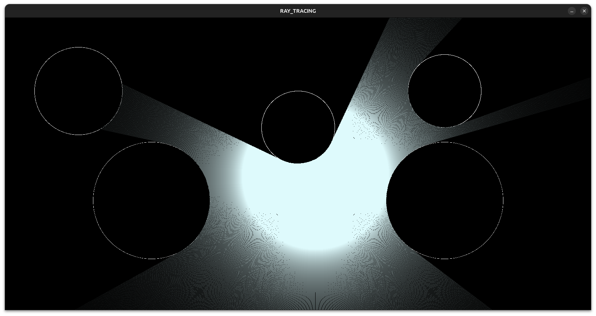

# 🌟 Ray Casting Simulation using SDL2 in C

## 📝 Overview

This project implements a 2D ray-casting simulation using the SDL2 library in C. The simulation models how light rays interact with circular obstacles, casting dynamic shadows. You can move the light source (a circle) using your mouse to observe the effect on ray propagation and shadow formation.

## 🚀 Features

- **🌞 Dynamic Ray-Casting**: Simulates the propagation of light rays in a 2D plane.
- **🕶️ Shadow Casting**: Circular obstacles block rays, creating realistic shadow effects.
- **🖱️ Mouse Interaction**: Move the light source by dragging your mouse.
- **⚙️ Customizable Parameters**: Adjust the number of rays, circle properties, and motion of obstacles.

## 📐 Physics Behind the Simulation

### 1. Ray Propagation

Each ray is defined by a starting point \((x_0, y_0)\) and an angle (\theta). The ray's position \((x, y)\) is updated incrementally using trigonometric functions:

$$
\begin{aligned}
    x &= x_0 + t \cdot \cos(\theta) \\
    y &= y_0 + t \cdot \sin(\theta)
\end{aligned}
$$

Where:
\begin
- \((x_0, y_0)\) is the starting position of the ray (the light source).
- \(t\) is the distance traveled along the ray.
- \(\theta\) is the angle of the ray in radians.
\end
### 2. Circle Intersection

To check if a ray intersects a circle, we calculate the Euclidean distance between the ray's current point \((x, y)\) and the circle's center \((x_c, y_c)\):

$$
(x - x_c)^2 + (y - y_c)^2 \leq r^2
$$

Where:

- \((x_c, y_c)\) is the center of the circle.
- \(r\) is the radius of the circle.

If this condition is met, the ray is considered to have intersected the circle, and propagation stops.

### 3. 💡 Light Intensity

Light intensity decreases with the square of the distance according to the inverse-square law:

$$
I = \frac{I_0}{d^2 + 1}
$$

Where:

- \(I\) is the observed intensity.
- \(I_0\) is the initial intensity.
- \(d\) is the distance between the light source and the point.

This ensures distant points are dimmer while closer points are brighter.

## 📦 Requirements

- SDL2 Library

On Ubuntu, install SDL2 with:

```bash
sudo apt-get update
sudo apt-get install libsdl2-dev
```

## 🛠️ Compilation

```bash
gcc ray_casting.c -o ray_casting -lSDL2 -lm
```

## ▶️ Usage

Run the compiled executable:

```bash
./ray_casting
```

- **🖱️ Move the Light Source**: Click and drag the mouse to move the light source.
- **❌ Exit the Program**: Close the window or press the close button.

## 📂 Code Structure

- **🟢 Circle Structure**: Defines the position and radius of obstacles and the light source.
- **➡️ Ray Structure**: Stores the starting point and direction (angle) of each ray.
- **📊 Functions**:
  - `FillCircle_Outline`: Renders the outline of circles.
  - `generate_rays`: Initializes rays uniformly around the light source.
  - `RayIntersectsCircle`: Checks if a ray intersects any obstacle.
  - `FillRays`: Simulates ray propagation and renders light intensity.

## 🧰 Customization

You can modify the following parameters in the code:

```c
#define RAYS_NUMBER 2000 // Number of light rays
#define MAX_SHADOWS 10   // Maximum number of circular obstacles
```

## 📸 Example Output

A light source casting rays and forming shadows around circular obstacles:



## 📈 Future Improvements

- 🔄 Add more complex obstacle shapes.
- 🔍 Implement reflective and refractive surfaces.
- ⚡ Optimize performance for higher ray counts.

## 📜 License

This project is open-source and licensed under the MIT License.

